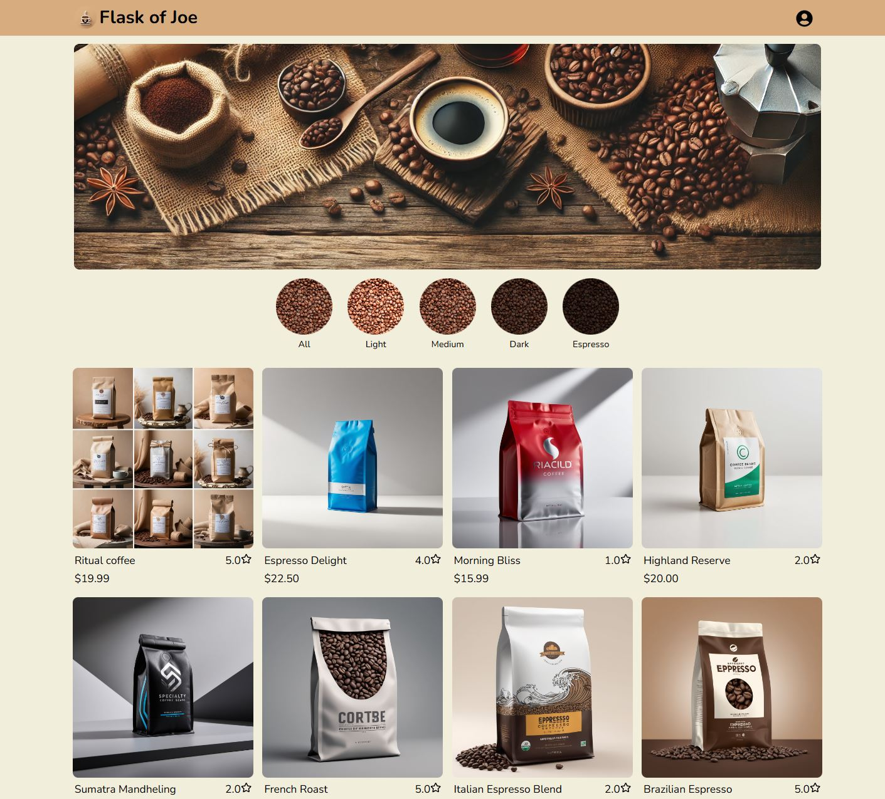

# This is Flask of Joe

Welcome to Flask of Joe, your ultimate destination for discovering and savoring specialty brewed coffee from individual roasters around the globe. Our e-commerce platform is dedicated to celebrating the artistry and passion of small-batch coffee producers, offering a curated selection of unique blends and single-origin beans that you won’t find anywhere else. By connecting coffee enthusiasts with talented roasters, Flask of Joe empowers artisans to share their craft while providing customers with a diverse array of flavors and experiences. Dive into the world of premium coffee and elevate your daily brew with the exceptional offerings from our community of skilled roasters!

[Live site](https://flask-of-joe.onrender.com/)

## Technologies

### Backend

Python:
Flask, WTForms, Boto3 (AWS S3)

DataBase:
SQLAlchemy(dev), flask-alembic, PostgreSQL(production)

### Frontend

JavaScript:
Vite, React, Redux(State-Management)

Landing page:

Details page:

Favorites page:

Manage products page:

New coffee form page:

Cart page:

